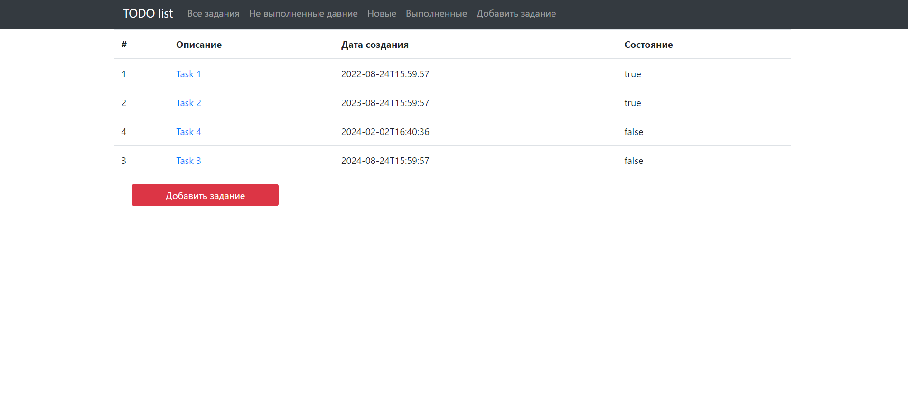
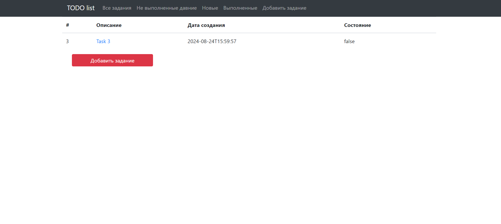
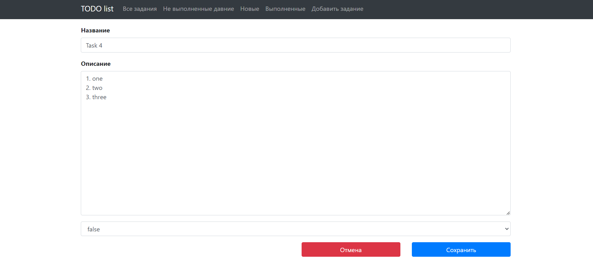

Приложение TODO list.

Описание проекта.
Проект представляет собой приложение для создания списка заданий.
У пользователя есть возможность создавать, удалять, отмечать выполненные, редактировать задания.

Стек технологий.
Java 17
Spring Boot
Thymeleaf
Liquibase
PostgreSQL 15
Hibernate
Junit 5

Требования к окружению. Java 17, Maven 3.8, PostgreSQL 15;

Запуск проекта.
Скачать проект с репозитория
Создать базу данных todo
Выполнить команду liquibase:update для создания таблиц
Запустить приложение src\main\java\ru\job4j\todo\Main
Адрес доступа localhost:8080

Взаимодействие с приложением:
1. Список всех заданий
   

2. Список выполненных заданий
   

3. Список новых заданий
   

4. Создание нового задания
   

5. Просмотр созданного задания
   

6. Редактирование задания
   
